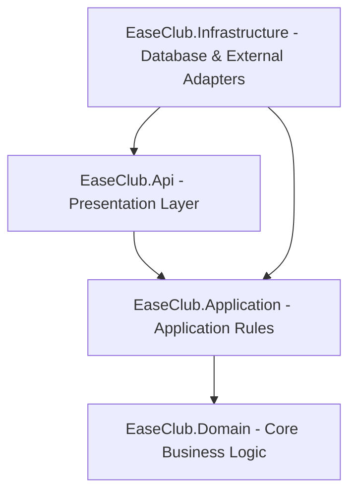

# EaseClub Backend

[](https://dotnet.microsoft.com/)
[](https://learn.microsoft.com/en-us/ef/core/)
[](https://learn.microsoft.com/en-us/dotnet/csharp/)
[](https://xunit.net/)
[](https://opensource.org/licenses/MIT)

EaseClub is a highly scalable, multi-tenant backend management system designed to coordinate club memberships, custom sign-up workflows, billing, events, and push notifications. Exposing a unified RESTful API, EaseClub serves both web applications (Angular) and mobile clients (Flutter) from a single source of truth.

The codebase is built on **Clean Architecture** and **Domain-Driven Design (DDD)** principles, utilizing **CQRS** (Command Query Responsibility Segregation) to maintain separate read/write models.

---

## 🏛️ System Architecture

EaseClub follows Clean Architecture to decouple core business logic from infrastructure frameworks, databases, and client presentation.



### Layer Breakdown

* 📂 **`src/EaseClub.Domain`**
  * **Role:** The core of the system containing domain entities, aggregate roots, value objects, and domain exceptions.
  * **Key Patterns:** Encapsulated domain logic, self-validating entities (e.g., ensuring `RenewPrice > 0`), and custom domain exceptions. No external dependencies.
* 📂 **`src/EaseClub.Application`**
  * **Role:** Use cases and orchestration logic.
  * **Key Patterns:** MediatR for CQRS (split into `Commands` and `Queries` under functional features), FluentValidation pipeline behaviors, custom response schemas, and system abstractions.
* 📂 **`src/EaseClub.Infrastructure`**
  * **Role:** Implementation of external services, persistence databases, background tasks, and utility classes.
  * **Key Patterns:** EF Core DbContext with global query filters for multi-tenant isolation, SignalR Hubs, Firebase Cloud Messaging (FCM) wrappers, and custom query services for paginated grids.
* 📂 **`src/EaseClub.Api`**
  * **Role:** Presentation layer exposing REST APIs, managing controller routes, handling authorization/authentication filters, and generating Swagger/OpenAPI specifications.

---

## 🏢 Multi-Tenancy & Tenant Isolation

EaseClub is built from the ground up as a **multi-tenant** system, hosting multiple distinct clubs in a single database instance.
* **Tenant Identification:** Each request to protected resources includes a tenant context (club identification) resolved from the current user's authenticated JWT token.
* **Data Protection:** Global query filters are automatically applied in the EF Core context to restrict data access to the current tenant's space. This prevents cross-tenant data leaks at the database level.
* **Command Validation:** Pipelines include validation behaviors (e.g., `IRequireClubOwnershipValidation`) to verify ownership properties before mutating state.

---

## 📦 Core Modules & Features

### 📋 Dynamic Membership Applications
* Customizable multi-step enrollment form builder per membership type.
* Structure: `Step` ➔ `Section` ➔ `Field` (supporting multiple types like text, dropdown, attachments).
* Progressive step submission and state validation before an application transitions to final approval.

### 💳 Installment & Invoice Engine
* Automatically generates complex payment/installment schedules when an enrollment is approved.
* Domain-level tracking of active, pending, overdue, and paid invoices.
* Integration with the **Geidea Payment Gateway** for secure checkout and webhook-driven transaction reconciliation.

### 🔔 Hybrid Notification Hub
* Real-time notifications pushed to browser clients using SignalR WebSockets.
* Native mobile push notifications sent to Android/iOS devices using Firebase Cloud Messaging (FCM).
* Dedicated background cleanups (`FcmTokenCleanupWorker`) keeping registration tokens fresh and valid.

### ⚡ Performance-Optimized Pagination & Projection
* Reusable pagination service supporting offset and cursor-based navigation.
* Dynamic query projections to retrieve only requested fields directly from the database, minimizing serialization latency.

---

## 🛠️ Tech Stack

* **Language & Framework:** C# 13, .NET 9, ASP.NET Core
* **Persistence:** EF Core, SQL Server / PostgreSQL (relational modeling)
* **Design Patterns:** CQRS (MediatR), Repository / Unit of Work, Fluent Validation Pipelines
* **Realtime & Messaging:** ASP.NET Core SignalR, Firebase Admin SDK
* **Logging & Monitoring:** Serilog structured logging, BetterStack integration
* **Security:** JWT Authentication, Role-based Access Control (RBAC), Global Tenant Filter
* **Testing:** xUnit, Moq, FluentAssertions, WebApplicationFactory (Integration Tests)

---

## 🚀 Getting Started

### Prerequisites
* **SDK:** [.NET 9.0 SDK](https://dotnet.microsoft.com/download/dotnet/9.0)
* **Database:** SQL Server or PostgreSQL (specified in your connection string)

### Local Configuration

1. **Clone the repository and copy the environment template:**
   ```bash
   cp .env.example .env.development
   ```
2. **Update `.env.development`** with your local developer credentials (e.g., database connection string, secret key, Geidea credentials, Firebase JSON config).

### Run & Start

> [!IMPORTANT]
> **Automatic Database Setup in Development:**
> In the `Development` environment, the API automatically initializes the database using `EnsureCreatedAsync` at startup (see `AppDbContextInitializer.cs`).
> * This means you **do not** need to manually run migrations (`dotnet ef database update`) to get started. Just run the project, and the database schema will be created and fully seeded with test data automatically.
> * Note: `EnsureCreatedAsync` bypasses EF Core's migrations history table. If you want to use EF migrations for local development, you should comment out or modify the `InitDevAsync()` call inside `AppDbContextInitializer.cs`.

1. **Run the API server:**
   ```bash
   dotnet run --project src/EaseClub.Api
   ```
2. **Explore the endpoints:**
   Once running, visit the interactive Swagger UI at:
   ```text
   http://localhost:5168/swagger
   # or (if HTTPS is enabled)
   https://localhost:7006/swagger
   ```

---

## 🧪 Test Suite

EaseClub maintains full coverage of domain invariants, command pipelines, and API integrations.

```bash
dotnet test
```

The testing suite contains **213 tests** spanning across:
* **`EaseClub.Domain.Tests` (145 tests):** Validates entities, value objects, domain rules, constraints, and exceptions.
* **`EaseClub.Application.Tests` (56 tests):** Validates query handlers, command logic, validation pipelines, and mapped responses.
* **`EaseClub.Api.IntegrationTests` (12 tests):** Bootstraps an in-memory test server to run end-to-end HTTP request/response flows against secured API endpoints.

---